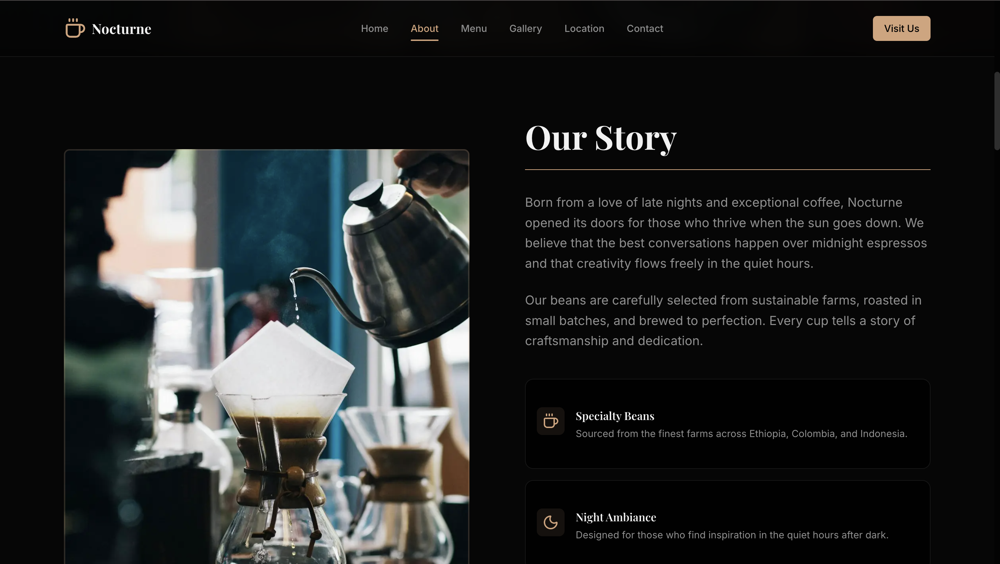
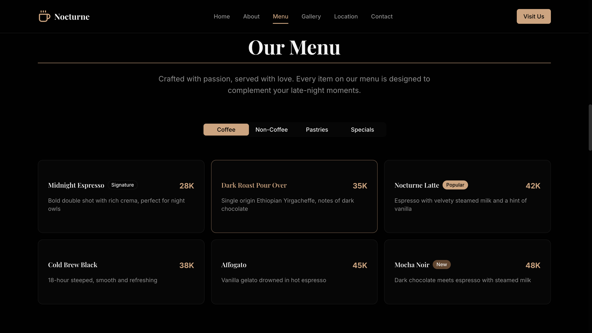
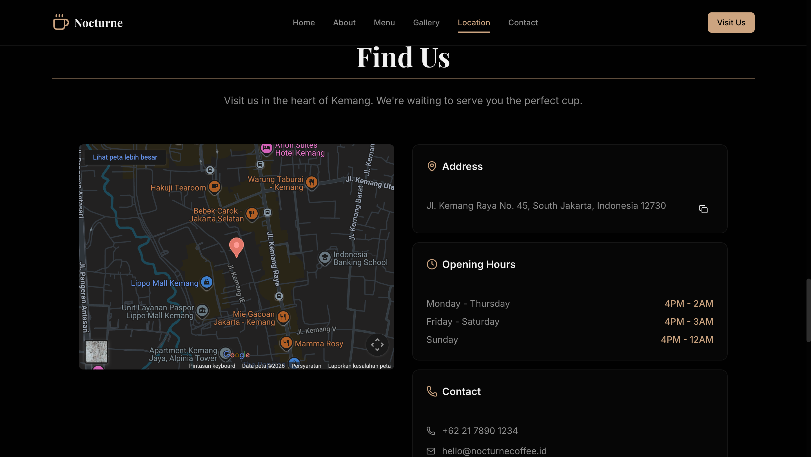
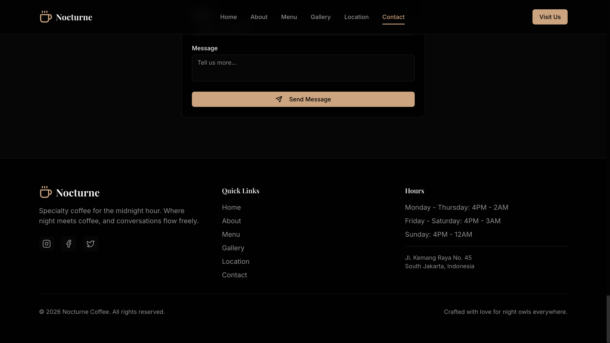

# Nocturne Coffee

A modern, high-performance landing page for a specialty coffee shop. Built with Next.js 14, Tailwind CSS, and shadcn/ui components.

**Live Demo:** [nocturen-landing-page.vercel.app](https://nocturen-landing-page.vercel.app)


## Lighthouse Scores

Achieved perfect 100 scores across all categories:


| Category | Score |
|----------|-------|
| Performance | 100 |
| Accessibility | 100 |
| Best Practices | 100 |
| SEO | 100 |

## Features

- **Dark Theme** - Industrial hipster aesthetic with warm gold accents
- **Fully Responsive** - Optimized for all screen sizes
- **Scroll Animations** - Smooth CSS-based animations with Intersection Observer
- **SEO Optimized** - JSON-LD structured data, sitemap, robots.txt
- **PWA Ready** - Web app manifest with custom icons
- **Accessible** - WCAG compliant with proper ARIA labels and keyboard navigation
- **Form Validation** - Contact form with Zod schema validation
- **Image Optimization** - Next.js Image with blur placeholders

## Screenshots

### Hero Section


### About Section


### Menu Section


### Gallery Section


### Location Section


### Contact & Footer


## Tech Stack

- **Framework:** Next.js 14 (App Router)
- **Styling:** Tailwind CSS v4
- **Components:** shadcn/ui
- **Fonts:** Playfair Display (serif) + Inter (sans)
- **Icons:** Lucide React
- **Form Handling:** React Hook Form + Zod
- **Toast Notifications:** Sonner
- **Analytics:** Vercel Analytics & Speed Insights
- **Deployment:** Vercel

## Performance Optimizations

- CSS-based animations (no JavaScript animation libraries)
- Intersection Observer for scroll-triggered animations
- Image blur placeholders for better LCP
- Dynamic imports for below-fold components
- Optimized font loading with `next/font`

## Getting Started

### Prerequisites

- Node.js 18+
- npm or yarn

### Installation

```bash
# Clone the repository
git clone https://github.com/ilhammramadhan/nocturen-landing-page.git

# Navigate to project directory
cd nocturne-coffee

# Install dependencies
npm install

# Run development server
npm run dev
```

Open [http://localhost:3000](http://localhost:3000) to view the site.

### Build for Production

```bash
npm run build
npm start
```

## Project Structure

```
nocturne-coffee/
├── src/
│   ├── app/
│   │   ├── layout.tsx      # Root layout with metadata
│   │   ├── page.tsx        # Home page
│   │   ├── globals.css     # Global styles & animations
│   │   ├── manifest.ts     # PWA manifest
│   │   ├── sitemap.ts      # Dynamic sitemap
│   │   └── robots.ts       # Robots.txt config
│   ├── components/
│   │   ├── ui/             # shadcn/ui components
│   │   ├── navbar.tsx      # Navigation bar
│   │   ├── hero.tsx        # Hero section
│   │   ├── about.tsx       # About section
│   │   ├── menu.tsx        # Menu section
│   │   ├── gallery.tsx     # Gallery with lightbox
│   │   ├── location.tsx    # Location & contact info
│   │   ├── contact.tsx     # Contact form
│   │   ├── footer.tsx      # Footer
│   │   └── motion.tsx      # Animation components
│   └── lib/
│       ├── data.ts         # Menu & business data
│       ├── images.ts       # Image data with blur placeholders
│       └── schema.ts       # JSON-LD structured data
├── public/
│   └── icons/              # PWA icons
└── screenshots/            # Project screenshots
```

## License

MIT License

## Author

Ilham Ramadhan - [GitHub](https://github.com/ilhammramadhan)
